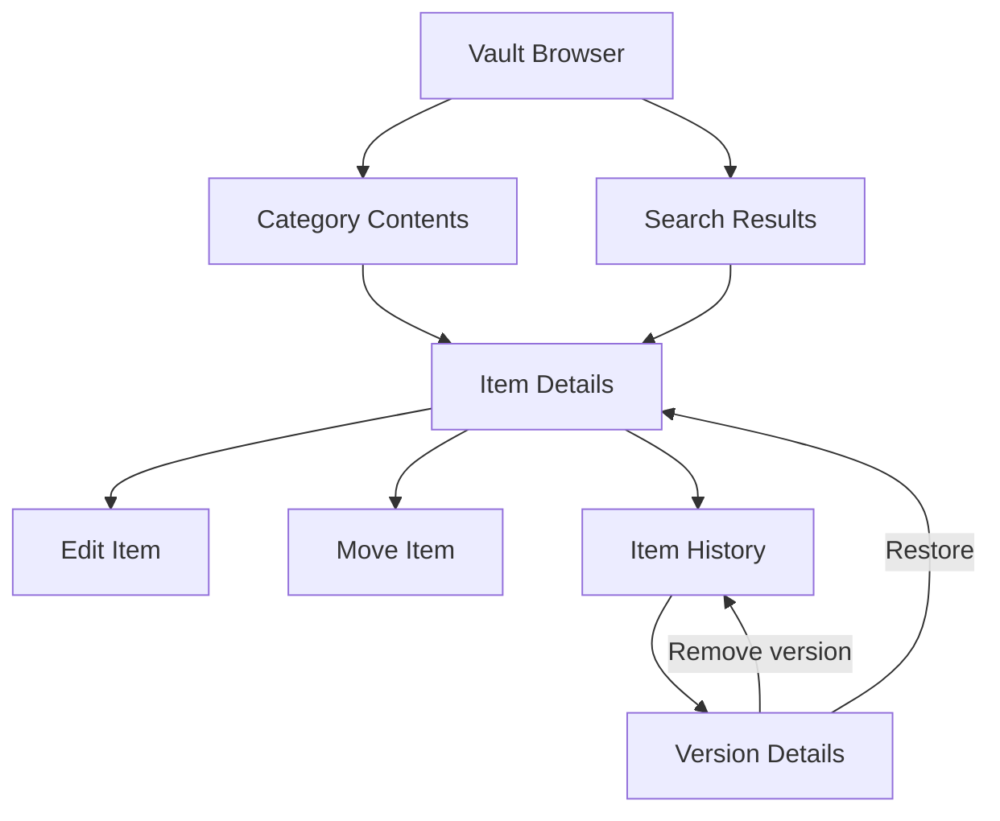

# Keepriva UI Restructure, Item History, and Parallel Test Execution Plan

## 1. Document purpose

This document defines the sequential implementation plan for the next Keepriva Android development cycle. It covers:

- A KeePass2Android-inspired, independently implemented vault browsing experience.
- A separate item-search results view.
- Copy-to-clipboard actions for every displayed item value.
- Explicit movement of an item between categories.
- Item creation and modification timestamps.
- Encrypted item version history, version inspection, restoration, and removal.
- Backup and restore compatibility for version history.
- Production tests and instrumentation tests delivered with every phase.
- Refactoring the GitHub Actions workflow so emulator tests run in isolated logical batches in parallel.

This is an implementation roadmap, not an authorization to change the current green branch. Each phase must be implemented, reviewed, tested, and merged independently.

---

## 2. Confirmed baseline

| Baseline item | Current value |
|---|---|
| Repository | `subinks/Keepriva_Android` |
| Branch | `ui_enhancement` |
| Green commit | `6851c467896abc3d8d375cfb9f237379adce5708` |
| Green workflow run | `35973848830` |
| Workflow wall-clock duration | Approximately 18 minutes 22 seconds |
| Android instrumentation tests | 89 methods across 9 test classes |
| Normal blocking tests | 88 |
| Biometric CI diagnostic | 1 conditional/non-blocking test |
| Database version | 3 |
| Encrypted backup format version | 1 |
| Application architecture | One `Activity`, programmatically created views and dialogs |

Before starting implementation, create a protected baseline tag from the green commit:

```text
ui-enhancement-green-2026-09-24
```

All redesign work should begin from a new branch such as:

```text
ui_restructure_v2
```

Do not continue stacking major redesign patches directly on the established green commit.

---

## 3. Scope and non-goals

### 3.1 In scope

1. Restructure the vault home screen into category navigation and compact item lists.
2. Introduce dedicated full-screen views for search, item details, history, and historical-version details.
3. Preserve Keepriva's green/white identity and all current security behavior.
4. Add field-level secure clipboard actions.
5. Add explicit item movement between categories.
6. Display item creation and modification timestamps.
7. Add encrypted historical snapshots for item changes.
8. Extend encrypted backup and restore to include history.
9. Update existing tests and add new tests in the same phase as each production change.
10. Parallelize emulator verification by logical feature group.

### 3.2 Out of scope for this cycle

- Dropbox, cloud, WebDAV, or network synchronization.
- Adding the `INTERNET` permission.
- Copying KeePass2Android source code, icons, assets, or layouts.
- Changing Keepriva's encryption hierarchy or master-password derivation unless a separately reviewed security need is found.
- Autofill or a custom Keepriva keyboard.
- Multi-device conflict resolution.
- Multiple vault files.

---

## 4. Architectural decisions to make once and retain

These decisions prevent repeated design changes during implementation.

### 4.1 Retain a single activity as the security/session owner

`MainActivity` should continue to own the in-memory `SecretKey`, auto-lock lifecycle, screen protection, and clipboard cleanup.

Do not pass the vault key through:

- `Intent` extras.
- `Bundle` values.
- Saved-instance state.
- Files or shared preferences.
- Static global variables.

### 4.2 Introduce an internal screen-navigation layer

Extract the large programmatic UI from `MainActivity` into screen components while keeping one activity:

```text
MainActivity
  VaultScreenRouter
    VaultBrowserScreen
    SearchResultsScreen
    ItemDetailsScreen
    ItemEditorScreen
    MoveItemScreen
    ItemHistoryScreen
    ItemVersionDetailsScreen
```

`MainActivity` remains responsible for sensitive state and supplies callbacks to the screens. The screen router maintains a small in-memory navigation stack and clears it immediately when the vault locks.

This approach avoids a high-risk, all-at-once migration to multiple activities or a new application framework. Fragments can be considered later, after the UI and security behavior are stable.

### 4.3 Use reusable XML layouts and list row components

Move new screens and reusable rows to XML resources. Use a `RecyclerView` with stable item IDs for:

- Category rows.
- Item rows.
- Search results.
- Version-history rows.

Do not rebuild an entire long `LinearLayout` tree for every search keystroke.

### 4.4 Preserve semantic accessibility identifiers

Every screen and action requires a stable semantic identifier/content description. Tests should prefer these identifiers over visible wording.

Examples:

```text
Screen vault browser
Screen search results
Screen item details
Screen item history
Open category Work
Open item GitHub Admin
Copy Username / Email
Move item
Restore item version
Remove item version
```

### 4.5 Use full-screen views for primary workflows

Dialogs should remain only for short decisions, confirmation, reauthentication, and small option selectors. Search, item details, editing, and history should be full-screen views.

This reduces cramped layouts and avoids the dialog-root/window-focus failures previously encountered by Espresso.

---

## 5. Target screen flow



The Android Back action must return to the previous screen and restore the prior category, query, and scroll position. Locking the vault must discard the complete screen stack and show the unlock screen.

---

## 6. Phase overview

| Phase | Primary outcome | Database change | Backup change | Main test impact |
|---|---|---:|---:|---|
| 0 | Freeze baseline and record measurements | No | No | Preserve 89-test baseline |
| 1 | Parallel CI/emulator foundation | No | No | Split existing tests into isolated batches |
| 2 | Screen router and reusable UI foundation | No | No | Navigation and lifecycle tests |
| 3 | Category-first vault browser redesign | No | No | Update home/category/smoke tests |
| 4 | Separate search-results screen | No | No | New search-results suite |
| 5 | Full-screen details, timestamps, and copy actions | No | No | New clipboard/details suite |
| 6 | Explicit move-item workflow | No | No | New move-item suite |
| 7 | Encrypted version-history storage | v3 to v4 | No | Migration and history repository tests |
| 8 | History and version-detail UI | Already v4 | No | New history UI suite |
| 9 | Version-aware backup and restore | No | v1 to v2 | Backup compatibility and round-trip tests |
| 10 | Integration, accessibility, visual verification, release gate | No | No | Full regression and screenshots |

Each phase is a merge boundary. Do not start the next phase until the current phase's exit criteria are green.

---

## 7. Detailed sequential implementation plan

## Phase 0 - Freeze and document the green baseline

### Objective

Create a recoverable starting point and capture the current workflow/test characteristics before any structural change.

### Production tasks

1. Tag commit `6851c467896abc3d8d375cfb9f237379adce5708`.
2. Create `ui_restructure_v2` from that tag/commit.
3. Record the current APK version, database version, and backup format version.
4. Record the latest successful workflow duration and each job/step duration.
5. Save the current setup, home, and unlock screenshots as baseline artifacts.
6. Confirm the manifest contains no `INTERNET` permission.

### Test tasks

1. Run the complete existing suite unchanged.
2. Confirm 88 normal tests pass.
3. Confirm the biometric CI test remains conditional/non-blocking.
4. Archive the test output and screenshot artifacts.

### Exit criteria

- The branch is created from the known green commit.
- The baseline tag exists remotely.
- The unchanged workflow is green.
- Baseline artifacts are retained for UI comparison.

### Rollback point

Return to the protected baseline tag.

---

## Phase 1 - Build once and execute emulator tests in parallel batches

### Objective

Reduce feedback time before the test suite grows, while preserving failure isolation and complete coverage.

### Workflow restructuring

Replace the current single `build-and-verify` job with these logical jobs:

```text
build-apks
  |
  +--> instrumentation matrix (parallel)
  |
  +--> visual-verification (parallel)
  |
  +--> verification-gate
```

### `build-apks` job responsibilities

1. Checkout source.
2. Set up JDK 17 and Gradle 9.1.0.
3. Install Android SDK 36 build components.
4. Apply the existing disposable debug screenshot-protection bypass.
5. Verify there is no `INTERNET` permission.
6. Run:

```text
:app:lintDebug
:app:testDebugUnitTest
:app:assembleDebug
:app:assembleDebugAndroidTest
```

7. Upload one immutable APK bundle containing:
   - `app-debug.apk`.
   - The instrumentation APK.
   - APK checksums.
8. Upload lint and JVM unit-test reports.

No emulator should be started in this job.

### Initial instrumentation matrix for the current 89 tests

| Batch ID | Test classes | Current test methods | Purpose |
|---|---|---:|---|
| `auth-lifecycle-smoke` | `KeeprivaAuthHomeTest`, `KeeprivaLifecycleRobustnessTest`, `KeeprivaUiSmokeTest` | 26 | Setup, unlock, lock, recreation, basic reachability |
| `categories` | `KeeprivaCategoryPreferencesTest`, `KeeprivaCategoryDeletionTest` | 24 | Category hierarchy, preferences, add/edit/delete behavior |
| `item-core` | `KeeprivaItemCrudTest` | 14 | Item creation, details, password display, search, delete/undo |
| `data-transfer` | `KeeprivaDataTransferTest` | 12 | Import, export, backup document intents and dialogs |
| `security` | `KeeprivaSecuritySettingsTest` | 12 | Reauthentication, auto-lock, clipboard, password and biometric settings |

The remaining `KeeprivaBiometricCiTest` stays in the separate visual/biometric diagnostic job because emulator biometric enrollment is environment-dependent.

### Instrumentation matrix behavior

1. Use `strategy.fail-fast: false` so all batches complete and report their failures in one workflow run.
2. Start one fresh API-35 emulator per matrix job.
3. Download the APK bundle built by `build-apks`.
4. Install the target and instrumentation APKs directly with `adb`.
5. Discover the registered instrumentation runner from the installed package instead of hard-coding it.
6. Run only the comma-separated classes assigned to that matrix entry.
7. Capture the complete instrumentation output.
8. Fail the job when output contains `FAILURES!!!`, `INSTRUMENTATION_FAILED`, an uncaught process crash, or lacks the expected `OK (` completion marker.
9. Capture filtered logcat and a screenshot on failure.
10. Upload uniquely named artifacts such as `instrumentation-categories`.

### Recommended workflow controls

```yaml
concurrency:
  group: keepriva-${{ github.workflow }}-${{ github.ref }}
  cancel-in-progress: true

strategy:
  fail-fast: false
  max-parallel: 5
```

`cancel-in-progress` avoids spending emulator minutes on an outdated commit after a newer commit is pushed.

### Visual-verification job

The visual job should run in parallel with the instrumentation matrix and must not rerun the complete instrumentation suite.

Its responsibilities are:

1. Install the APKs from the build artifact.
2. Capture deterministic setup, home, and real unlock screenshots.
3. Validate the corresponding UI hierarchy dumps.
4. Run only the optional biometric diagnostic test.
5. Upload screenshots, UI dumps, package diagnostics, and biometric logs.

Later phases will add browser, search, item-details, and history screenshots to this job.

### Verification gate

Add a final lightweight job that depends on:

- `build-apks`.
- Every instrumentation matrix result.
- `visual-verification`.

The gate succeeds only when the build and every blocking matrix batch succeed. The biometric diagnostic remains informational.

Use the gate job as the required branch-protection check, rather than requiring every dynamically named matrix job individually.

### Test tasks

1. Prove every existing test class appears in exactly one blocking batch, except the biometric diagnostic.
2. Compare the total executed test count with the baseline.
3. Intentionally fail one test in a disposable branch and verify:
   - Its logical batch fails.
   - Other batches continue because `fail-fast` is false.
   - The final gate fails.
   - The failing method is identifiable from the batch log.
4. Verify matrix jobs use the exact same APK bytes by comparing checksums.
5. Verify app data is isolated because each batch uses a fresh runner/emulator.

### Exit criteria

- The same 88 normal tests pass in parallel batches.
- The optional biometric diagnostic remains non-blocking.
- APKs are built once per workflow.
- No matrix job recompiles the application.
- The final gate accurately represents the complete workflow result.
- Parallel wall-clock time is measured over at least two green runs.

### Rebalancing rule

After two green runs, rebalance only if one batch consistently takes more than 30 percent longer than the median batch. Keep related classes together unless the time difference is material.

### Long-run safety net

Keep a manual or weekly full serial instrumentation workflow. Parallel isolation is the normal push/PR gate; the serial run detects accidental order dependence or leaked global state.

---

## Phase 2 - Introduce the screen router and reusable UI foundation

### Objective

Create the navigation and component foundation without changing user-visible functionality significantly.

### Production tasks

1. Add a root content container owned by `MainActivity`.
2. Add `VaultScreenRouter` with explicit screen states.
3. Define navigation state objects for:
   - Current category.
   - Search query.
   - Selected item ID.
   - Selected history-version ID.
   - List scroll position.
4. Extract reusable toolbar, empty-state, category-row, item-row, field-row, and action-row components.
5. Add a `RecyclerView` dependency and stable-ID adapters.
6. Keep `SecretKey` and security lifecycle behavior in `MainActivity`.
7. Clear the router stack and all sensitive screen state when the vault locks.
8. Add a screen-level loading/error state so database failures do not leave an empty or half-rendered screen.
9. Keep existing home behavior available until Phase 3 is complete.

### Test tasks

Add navigation/lifecycle coverage for:

- Router starts at vault browser after successful unlock.
- Back navigation restores the previous screen.
- Lock from any screen returns to unlock.
- Activity recreation never restores decrypted item values without unlocking.
- Screen stack is empty after explicit lock, auto-lock, or screen-off lock.
- No vault key or decrypted item is placed in a `Bundle`.

Update `KeeprivaLifecycleRobustnessTest` and add pure JVM tests for router-state transitions where possible.

### CI batch

- Instrumentation: `auth-lifecycle-smoke`.
- Pure routing-state tests: JVM tests in `build-apks`.

### Exit criteria

- Navigation infrastructure exists without changing persisted data.
- All old tests still pass or have equivalent semantic updates.
- Locking clears navigation and sensitive screen state.
- Back navigation has deterministic tests.

---

## Phase 3 - Redesign the vault browser

### Objective

Replace the long expandable tree with a category-first browser inspired by the useful navigation concepts in KeePass2Android.

### Production tasks

1. Add a top toolbar containing:
   - Current vault/category title.
   - Search.
   - Lock.
   - Overflow menu.
2. Add a breadcrumb showing the full current category path.
3. Render direct subcategories in a `Subcategories` section.
4. Render direct items in an `Items` section.
5. Use compact rows with semantic category/item icons.
6. Show item title and full category path; do not expose password or notes.
7. Add a floating `+` action with `Entry` and `Subcategory` options.
8. Move import, export, backup, preferences, security, and category management to the overflow menu.
9. Preserve selected category and scroll position when returning from details.
10. Preserve category-depth rules and built-in-category tombstones.
11. Keep empty states for:
    - Empty vault.
    - Empty category.
    - Category with subcategories but no direct items.

### Test tasks

Update existing tests that currently expect inline expansion:

- `KeeprivaAuthHomeTest`.
- `KeeprivaCategoryPreferencesTest`.
- `KeeprivaItemCrudTest`.
- `KeeprivaUiSmokeTest`.

Add/replace tests for:

- Built-in categories appear as browser rows.
- Custom root categories appear.
- Opening a category shows only direct children and direct items.
- Breadcrumb shows the complete category path.
- Back returns to the parent category.
- Item count remains correct.
- Category icons retain their semantic families.
- Floating add menu offers `Entry` and `Subcategory`.
- Overflow actions remain reachable.
- Empty-category state is visible.
- Lock remains accessible from the toolbar.

### CI batch

- `categories` for hierarchy and category management.
- `item-core` for category-to-item navigation.
- `auth-lifecycle-smoke` for toolbar and reachability checks.

### Visual artifacts

Add screenshots for:

- Root vault browser.
- A nested category.
- Empty category.

### Exit criteria

- No item is lost or moved by the UI redesign.
- All previous category CRUD and deletion behavior remains green.
- The home screen no longer depends on expanding the complete tree.
- Management tools remain accessible but do not dominate the vault content.

---

## Phase 4 - Add the dedicated search-results screen

### Objective

Move search results out of the category hierarchy into a separate compact list.

### Production tasks

1. Search toolbar action opens `SearchResultsScreen`.
2. Add a focused search input and clear-query action.
3. Reuse the current search fields:
   - Title.
   - Category.
   - Username/email.
   - Phone numbers.
   - Website/app name.
   - Website URL.
   - Notes.
   - Custom-field names and values.
4. Continue excluding passwords from search indexing.
5. Return only matching items, not category branches.
6. Each row displays only:
   - Item icon.
   - Item title.
   - Full category path.
7. Do not show sensitive snippets explaining why an item matched.
8. Sort results deterministically: normalized title, then category path, then item ID.
9. Add result count, empty query, and no-results states.
10. Opening a result navigates to full-screen item details.
11. Back restores the prior query and result-list position.
12. Debounce filtering only if measurement shows it is needed; do not introduce arbitrary test sleeps.

### Test tasks

Create `KeeprivaSearchResultsTest` with cases for:

- Search opens as a separate screen.
- Title match shows title and full category path.
- Username match returns the item without exposing username in a result snippet unless deliberately approved.
- Notes match returns the item without displaying notes.
- Custom-field value match returns the item without exposing the value.
- Password text does not produce a result.
- Matching is case-insensitive.
- Nonmatching items are absent.
- No-results state appears.
- Clear-query resets the list.
- Opening a result shows the correct item.
- Back restores query and position.

Move obsolete inline-search assertions out of `KeeprivaItemCrudTest` and `KeeprivaCategoryPreferencesTest`.

Add pure JVM tests for search normalization and matching. Keep only screen behavior in emulator tests.

### CI batch

Rename/expand `item-core` to `item-core-search`:

```text
KeeprivaItemCrudTest
KeeprivaSearchResultsTest
```

### Visual artifacts

- Search with results.
- Search with no results.

### Exit criteria

- Search is no longer rendered inside the category tree.
- Result rows contain item title and category path.
- Search does not reveal password or sensitive snippets.
- Search logic has fast JVM coverage and focused UI coverage.

---

## Phase 5 - Full-screen item details, timestamps, and secure copy actions

### Objective

Replace the item-details dialog with a professional full-screen view and add secure copying for every displayed value.

### Production tasks

1. Create `ItemDetailsScreen` with:
   - Back navigation.
   - Item title.
   - Edit action.
   - Overflow actions for move, export, and delete.
2. Render reusable field rows for every non-empty value.
3. Keep passwords masked initially with separate reveal/hide and copy controls.
4. Add copy actions for:
   - Category path.
   - Username/email.
   - Password.
   - Phone 1, 2, and 3.
   - Website/app name.
   - Website URL.
   - Notes.
   - Every custom field.
   - Created timestamp.
   - Modified timestamp.
5. Route every copy operation through `ClipboardSecurityManager.copySensitive()`.
6. Respect the configured clipboard-clear timeout.
7. Show a short confirmation including the timeout, without repeating the copied value.
8. Display `createdAt` and `updatedAt` using locale-aware date/time formatting.
9. Preserve existing sensitive custom-field masking.
10. Ensure locking or leaving the vault clears Keepriva-owned clipboard content according to current security rules.

### Test tasks

Create `KeeprivaClipboardActionsTest` and update `KeeprivaItemCrudTest`.

Required tests:

- Details open as a full-screen view, not a dialog.
- Password is masked initially.
- Reveal/hide remains functional.
- Every populated field exposes a correctly labelled copy action.
- Empty fields do not create blank rows or copy buttons.
- Standard and custom fields use the secure clipboard manager.
- Copy confirmation does not expose the copied secret.
- A newer clipboard value is not erased by an older delayed-clear task.
- Created timestamp is stable after editing.
- Modified timestamp increases after editing.
- Lock from details returns to unlock and removes sensitive details from the hierarchy.

Clipboard timing and ownership logic should remain covered mainly by JVM/unit tests where practical. UI tests should verify wiring and accessibility rather than waiting 15-60 seconds.

### CI batch

Add a future batch:

```text
item-actions
  KeeprivaClipboardActionsTest
```

Keep core CRUD in `item-core-search`.

### Visual artifacts

- Item details with standard fields.
- Masked password row.
- Item details with custom fields.

### Exit criteria

- The old details dialog is removed.
- Every displayed value has a deterministic secure copy action.
- Created and modified timestamps are visible and correct.
- No raw secret appears in toast text, logcat, or accessibility descriptions.

---

## Phase 6 - Add explicit item movement

### Objective

Provide a clear Move action independent of full item editing.

### Production tasks

1. Add `Move item` to item-details actions.
2. Create a hierarchical destination selector showing full category paths.
3. Mark the current category and disable a no-op move.
4. Exclude hidden/deleted built-in categories.
5. Validate the destination at commit time, not only when the selector opens.
6. Update only the item's category.
7. Preserve item ID, creation time, and all other values.
8. Update modification time.
9. Perform the operation transactionally.
10. Return to item details and display the new category path.
11. When returning to the browser, open the destination category.
12. Add a confirmation only if needed for clarity; moving itself is reversible through the later version-history feature.

### Test tasks

Create `KeeprivaItemMoveTest` with cases for:

- Move action is available from details.
- Destination list contains built-in and custom categories.
- Nested destinations show full paths.
- Current category cannot be selected as a meaningful move.
- Cancel leaves the item unchanged.
- Move preserves every field and the item ID.
- Move preserves creation time.
- Move updates modification time.
- Item disappears from the old category and appears in the destination.
- Move to a nested custom category works.
- Hidden/deleted category is not selectable.
- Database failure produces no partial move.

Until Phase 7 is present, explicitly mark the version-snapshot assertion as pending; add it immediately in Phase 7.

### CI batch

Add `KeeprivaItemMoveTest` to `item-actions`.

### Exit criteria

- Item movement is discoverable without editing all fields.
- Moves are atomic and preserve item data.
- The browser and search results immediately reflect the new path.

---

## Phase 7 - Add encrypted item-version storage and v3-to-v4 migration

### Objective

Add a safe data foundation for version history before exposing history UI.

### Database design

Increase database version from 3 to 4 and add `vault_item_versions`.

Suggested logical columns:

```text
id                 INTEGER PRIMARY KEY AUTOINCREMENT
item_id            INTEGER NOT NULL
version_number     INTEGER NOT NULL
encrypted_snapshot TEXT NOT NULL
captured_at        INTEGER NOT NULL
```

Add indexes for:

```text
(item_id, version_number DESC)
(item_id, captured_at DESC)
```

The encrypted snapshot contains:

- Complete prior item values.
- Prior `createdAt` and `updatedAt`.
- Change reason: edited, moved, or restored.
- Changed field names.

Do not store field values or field-change details in plaintext metadata.

### Production tasks

1. Add the explicit sequential `migrate3To4()` path.
2. Update schema verification to require the history table and indexes.
3. Add `VaultItemVersion` model.
4. Extract item persistence/history operations behind focused repository methods.
5. When an existing item changes:
   - Read the current item.
   - Compare normalized values.
   - If nothing changed, do not create a version.
   - Otherwise insert the encrypted current snapshot.
   - Update the current item.
   - Commit both operations in one transaction.
6. Capture versions for edits and category moves.
7. Add a retention policy of 20 versions per item.
8. Delete only the oldest excess versions after a successful new snapshot, in the same transaction.
9. Define deletion behavior:
   - Permanent item deletion deletes its versions.
   - Immediate Undo must restore the item and its captured versions.
   - Force-delete of a category subtree deletes corresponding histories atomically.
10. Keep imports without history valid.

### Test tasks

Create `KeeprivaItemVersionMigrationTest` and repository-level instrumentation tests.

Required tests:

- Fresh install creates schema v4.
- v3 database upgrades to v4 without item/category loss.
- Migration history records v3 to v4 once.
- Existing timestamps and encrypted payloads remain readable.
- Editing creates exactly one previous version.
- Moving creates exactly one previous version.
- Saving unchanged data creates no version.
- Failed update creates neither a partial version nor a partial current update.
- Snapshots decrypt only with the correct vault key.
- Version ordering is deterministic.
- The 21st version removes only the oldest snapshot.
- Permanent deletion removes history.
- Delete then immediate Undo restores current item and history.
- Category force-delete removes histories belonging to deleted items.
- Database downgrade remains rejected.

Add pure JVM tests for change detection, changed-field naming, and retention selection.

### CI batch

Add a dedicated `history-storage` matrix batch.

This batch must remain separate from ordinary UI tests so schema/migration failures are immediately visible.

### Exit criteria

- The v3-to-v4 migration is non-destructive and repeat-safe.
- Every modifying operation is atomic with its snapshot.
- No-op saves create no history noise.
- History retention is deterministic.
- All encrypted data remains unreadable without the vault key.

---

## Phase 8 - Add history list and version-detail UI

### Objective

Expose item history without weakening password masking or clipboard security.

### Production tasks

1. Add a `Previous versions` section to item details.
2. Show versions newest first with:
   - Date and time.
   - Change reason.
   - Changed field names.
3. Show a clear no-history state.
4. Open a dedicated read-only `ItemVersionDetailsScreen`.
5. Display the complete historical snapshot using the same field-row component as current details.
6. Keep historical passwords and sensitive custom fields masked initially.
7. Reuse secure copy actions and timeout behavior.
8. Add `Restore this version`.
9. Before restoring:
   - Confirm the action.
   - Verify the target item still exists.
   - Validate the historical category still exists.
10. If the historical category no longer exists, require a valid replacement category rather than creating an orphaned reference.
11. Restore all historical values while preserving current item ID and original creation date.
12. Snapshot the current item before restoration.
13. Set the restored current item's modification time to now.
14. Add `Remove this version` with confirmation.
15. Removing a historical version must not change the current item.

### Test tasks

Create `KeeprivaItemHistoryTest` with cases for:

- No-history state is displayed.
- Edit creates a dated history row.
- Move creates a history row with category change.
- Version rows are newest first.
- Changed-field names are correct and values are not shown in the list.
- Opening a row shows the correct historical snapshot.
- Historical password is masked initially.
- Historical values use secure copy actions.
- Cancel restore leaves current item unchanged.
- Restore updates current values and creates a snapshot of the replaced state.
- Restore preserves item ID and original creation time.
- Restore updates modification time.
- Missing historical category requires destination selection.
- Cancel remove keeps the version.
- Confirm remove deletes only the selected version.
- Back returns to the same history-list position.
- Lock from history/version details clears sensitive UI and returns to unlock.

### CI batch

Add `KeeprivaItemHistoryTest` to `history-storage`, unless runtime measurement requires a separate `history-ui` batch.

### Visual artifacts

- Item details with previous versions.
- History list.
- Historical-version details with masked password.
- Restore confirmation.

### Exit criteria

- Historical data is inspectable without exposing secrets by default.
- Restore and remove actions are transactional and independently tested.
- Missing-category restoration cannot create invalid data.

---

## Phase 9 - Add version-aware backup and restore

### Objective

Ensure encrypted backups preserve history while remaining backward compatible.

### Production tasks

1. Increase encrypted backup format from 1 to 2.
2. Add item-history records to the encrypted backup payload.
3. Keep the entire logical payload encrypted under the backup-password-derived key.
4. Update restore validation for:
   - History item references.
   - Duplicate version IDs/numbers.
   - Invalid timestamps.
   - Invalid or oversized history arrays.
5. Restore categories, current items, and history in one transaction.
6. Continue accepting format-v1 backups.
7. Treat v1 backups as current-state-only backups with empty history.
8. Reject unsupported future backup versions with a clear message.
9. Include history only in encrypted `.pvault` backups.
10. Keep TXT, HTML, PDF, and ordinary JSON exports current-state-only.
11. Document that plaintext/export formats intentionally exclude old credentials.

### Test tasks

Create `KeeprivaVersionedBackupTest` and extend `KeeprivaDataTransferTest`.

Required tests:

- Format-v2 backup contains current items and versions after decryption.
- Correct password round-trip restores version history.
- Wrong password restores nothing.
- Tampered history payload fails integrity/validation.
- Restore is atomic when a history reference is invalid.
- Format-v1 backup still restores successfully with empty history.
- Unsupported future format is rejected.
- TXT/HTML/PDF/ordinary JSON do not contain historical credentials.
- Encrypted backup does not contain plaintext current or historical secrets.
- Restore preserves version ordering and timestamps.
- Backup password arrays and plaintext buffers are cleared according to current security practice.

### CI batch

Expand `data-transfer`:

```text
KeeprivaDataTransferTest
KeeprivaVersionedBackupTest
```

If this batch becomes more than 30 percent slower than the median, split it into:

- `data-transfer-ui`.
- `backup-compatibility`.

### Exit criteria

- New encrypted backups preserve version history.
- Old encrypted backups remain compatible.
- Plaintext exports never include history.
- Invalid restores never partially replace the vault.

---

## Phase 10 - Integration, accessibility, visual QA, and release gate

### Objective

Verify the redesigned application as one coherent product and eliminate obsolete UI/test paths.

### Production tasks

1. Remove obsolete expandable-tree rendering and hidden list-container compatibility code.
2. Remove obsolete item-details dialog code.
3. Remove temporary adapters/helpers replaced by screen components.
4. Review typography, spacing, icons, touch targets, empty states, and error states.
5. Verify small phone, Pixel 6, landscape, and large-font behavior.
6. Verify all screens remain protected from screenshots in real non-CI builds.
7. Confirm the manifest still has no `INTERNET` permission.
8. Review log statements and error messages for secret leakage.
9. Update user documentation and release notes.

### Test tasks

1. Run every parallel batch.
2. Run the manual/weekly full serial suite.
3. Run database migration tests from realistic v1, v2, and v3 fixtures where available.
4. Run encrypted backup v1 and v2 compatibility tests.
5. Run accessibility checks for labels, focus order, and 48dp touch targets.
6. Capture final screenshots for:
   - Setup.
   - Unlock.
   - Root browser.
   - Nested category.
   - Search results.
   - Item details.
   - Move item.
   - History list.
   - Version details.
7. Compare screenshots with approved design baselines.
8. Verify no test uses arbitrary long sleeps when an explicit condition can be observed.
9. Verify no test depends on execution order or state left by another test.

### Exit criteria

- All blocking matrix batches pass.
- The serial regression suite passes.
- Lint and JVM unit tests pass.
- Screenshot/UI hierarchy verification passes.
- Backup compatibility and database migration gates pass.
- No release build security behavior was weakened for testing.
- The branch is ready for review and merge.

---

## 8. Final logical emulator-batch design

After all phases, use the following normal push/PR matrix.

| Batch | Classes | Expected focus |
|---|---|---|
| `auth-lifecycle-smoke` | `KeeprivaAuthHomeTest`, `KeeprivaLifecycleRobustnessTest`, `KeeprivaUiSmokeTest` | Setup, unlock, lock, recreation, global reachability |
| `categories` | `KeeprivaCategoryPreferencesTest`, `KeeprivaCategoryDeletionTest` | Category browser, hierarchy, preferences, deletion |
| `item-core-search` | `KeeprivaItemCrudTest`, `KeeprivaSearchResultsTest` | CRUD, browser-to-item navigation, dedicated search |
| `item-actions` | `KeeprivaClipboardActionsTest`, `KeeprivaItemMoveTest` | Field copy actions and category movement |
| `history-storage-ui` | `KeeprivaItemVersionMigrationTest`, `KeeprivaItemHistoryTest` | Schema v4, snapshots, restore/remove, history UI |
| `data-transfer` | `KeeprivaDataTransferTest`, `KeeprivaVersionedBackupTest` | Import/export and backup compatibility |
| `security` | `KeeprivaSecuritySettingsTest` | Reauthentication, auto-lock, clipboard policy, password, biometric settings |

`KeeprivaBiometricCiTest` remains in the non-blocking visual/biometric diagnostic job.

### Why classes are grouped this way

- A failed category test does not obscure an item-history failure.
- Database migration/history has its own diagnostic boundary.
- Data-transfer failures are isolated from ordinary item CRUD.
- Security settings remain independent from field-level clipboard UI tests.
- New feature classes can grow without making the original item CRUD class unmaintainable.

### Maximum parallelism

Start with `max-parallel: 5`. Seven matrix entries may execute in two waves if runner concurrency is limited. Increase only after observing queue time, runner availability, and total billed minutes.

Parallel execution reduces workflow wall-clock time but increases total emulator runner-minutes because every batch boots a separate emulator. The target is faster developer feedback with acceptable CI cost, not the smallest possible total compute usage.

---

## 9. Proposed GitHub Actions matrix blueprint

This is a design blueprint, not a drop-in replacement. Exact paths and runner detection must be validated in the implementation phase.

```yaml
jobs:
  build-apks:
    runs-on: ubuntu-latest
    timeout-minutes: 20
    steps:
      - uses: actions/checkout@v4
      - uses: actions/setup-java@v5
        with:
          distribution: temurin
          java-version: "17"
      - uses: gradle/actions/setup-gradle@v4
        with:
          gradle-version: "9.1.0"
      - name: Install Android build components
        run: sdkmanager "platforms;android-36" "build-tools;36.0.0" "platform-tools"
      - name: Compile, lint, unit test, and build APKs
        run: |
          gradle \
            :app:lintDebug \
            :app:testDebugUnitTest \
            :app:assembleDebug \
            :app:assembleDebugAndroidTest \
            --stacktrace
      - name: Stage APK bundle and checksums
        run: bash scripts/ci/stage-apks.sh
      - uses: actions/upload-artifact@v4
        with:
          name: keepriva-apks-${{ github.sha }}
          path: ci-apks/**
          retention-days: 7

  instrumentation:
    needs: build-apks
    runs-on: ubuntu-latest
    timeout-minutes: 18
    strategy:
      fail-fast: false
      max-parallel: 5
      matrix:
        include:
          - id: auth-lifecycle-smoke
            classes: >-
              com.example.privatevault.KeeprivaAuthHomeTest,
              com.example.privatevault.KeeprivaLifecycleRobustnessTest,
              com.example.privatevault.KeeprivaUiSmokeTest
          - id: categories
            classes: >-
              com.example.privatevault.KeeprivaCategoryPreferencesTest,
              com.example.privatevault.KeeprivaCategoryDeletionTest
          - id: item-core-search
            classes: >-
              com.example.privatevault.KeeprivaItemCrudTest,
              com.example.privatevault.KeeprivaSearchResultsTest
          - id: item-actions
            classes: >-
              com.example.privatevault.KeeprivaClipboardActionsTest,
              com.example.privatevault.KeeprivaItemMoveTest
          - id: history-storage-ui
            classes: >-
              com.example.privatevault.KeeprivaItemVersionMigrationTest,
              com.example.privatevault.KeeprivaItemHistoryTest
          - id: data-transfer
            classes: >-
              com.example.privatevault.KeeprivaDataTransferTest,
              com.example.privatevault.KeeprivaVersionedBackupTest
          - id: security
            classes: com.example.privatevault.KeeprivaSecuritySettingsTest
    steps:
      - uses: actions/checkout@v4
      - uses: actions/download-artifact@v4
        with:
          name: keepriva-apks-${{ github.sha }}
          path: ci-apks
      - name: Verify downloaded APK checksums
        run: sha256sum --check ci-apks/SHA256SUMS
      - name: Boot emulator and run batch
        uses: reactivecircus/android-emulator-runner@v2
        with:
          api-level: 35
          arch: x86_64
          profile: pixel_6
          target: google_apis
          disable-animations: true
          emulator-options: >-
            -no-window
            -no-snapshot
            -wipe-data
            -gpu swiftshader_indirect
            -noaudio
            -no-boot-anim
            -camera-back none
          script: |
            bash scripts/ci/run-instrumentation-batch.sh \
              "${{ matrix.id }}" \
              "${{ matrix.classes }}"
      - name: Upload batch diagnostics
        if: always()
        uses: actions/upload-artifact@v4
        with:
          name: instrumentation-${{ matrix.id }}
          path: ci-artifacts/${{ matrix.id }}/**
          retention-days: 14

  visual-verification:
    needs: build-apks
    runs-on: ubuntu-latest
    timeout-minutes: 18
    steps:
      - uses: actions/checkout@v4
      - uses: actions/download-artifact@v4
        with:
          name: keepriva-apks-${{ github.sha }}
          path: ci-apks
      - name: Boot emulator and capture deterministic UI states
        uses: reactivecircus/android-emulator-runner@v2
        with:
          api-level: 35
          arch: x86_64
          profile: pixel_6
          target: google_apis
          disable-animations: true
          script: bash scripts/ci/run-visual-verification.sh
      - name: Upload visual diagnostics
        if: always()
        uses: actions/upload-artifact@v4
        with:
          name: visual-verification
          path: ci-artifacts/visual/**
          retention-days: 14

  verification-gate:
    if: always()
    needs:
      - build-apks
      - instrumentation
      - visual-verification
    runs-on: ubuntu-latest
    steps:
      - name: Enforce complete verification result
        run: |
          test "${{ needs.build-apks.result }}" = "success"
          test "${{ needs.instrumentation.result }}" = "success"
          test "${{ needs.visual-verification.result }}" = "success"
```

---

## 10. CI helper-script requirements

Move complex shell logic out of YAML and into version-controlled scripts.

### `scripts/ci/stage-apks.sh`

Responsibilities:

1. Locate exactly one debug target APK.
2. Locate exactly one debug instrumentation APK.
3. Copy both to stable filenames.
4. Generate `SHA256SUMS`.
5. Fail on missing or ambiguous APKs.

### `scripts/ci/run-instrumentation-batch.sh`

Responsibilities:

1. Accept exactly two arguments: batch ID and comma-separated classes.
2. Configure deterministic emulator settings.
3. Install target and test APKs.
4. Detect and validate the instrumentation runner.
5. Clear the target package before the batch.
6. Run the selected classes.
7. Preserve complete output.
8. Detect test failures even if `adb shell am instrument` returns zero incorrectly.
9. Record test count and duration.
10. Capture process state, screenshot, UI dump, and filtered logcat on failure.
11. Never print vault passwords or other secrets.

### `scripts/ci/run-visual-verification.sh`

Responsibilities:

1. Create deterministic fixture data without weakening release behavior.
2. Capture approved screens.
3. Dump and validate UI hierarchies.
4. Run only the optional biometric diagnostic.
5. Keep biometric enrollment limitations non-blocking.

### Shell validation

Every helper must pass:

```text
bash -n
shellcheck
```

where ShellCheck is available in CI.

---

## 11. Test engineering rules for all phases

1. A production feature and its tests are one deliverable.
2. Tests must not depend on execution order.
3. Every test starts from explicit, isolated app state.
4. Prefer semantic content descriptions or resource IDs over coordinate clicks and fragile text matching.
5. Use `inRoot(isDialog())` only for genuine dialogs; full-screen views must use the activity root.
6. Avoid stateful indexed matchers when a semantic parent/child matcher is possible.
7. Avoid arbitrary sleeps. Wait for an observable screen marker, database result, or intent.
8. Do not make timing assertions against the real 15/30/60-second clipboard settings in UI tests; test timer policy below the UI.
9. Keep passwords, decrypted payloads, clipboard values, and backup passwords out of logs and assertion messages.
10. Use deterministic locale/time-zone handling for timestamp assertions.
11. Test dates by stored epoch values and formatted-pattern expectations, not by racing the wall clock.
12. Keep one accessibility/content-description contract for each screen and action.
13. When UI wording changes without semantic behavior changing, tests should normally remain stable.
14. Every database mutation test verifies both success and rollback behavior.
15. Migration tests must use real older-schema fixture databases, not only mocked version numbers.
16. Backup compatibility tests must keep sanitized v1 and v2 fixture files under test resources.

---

## 12. Branch and commit strategy

Use one short-lived branch per phase, based on the latest green point of `ui_restructure_v2`:

```text
phase-01-parallel-ci
phase-02-screen-router
phase-03-vault-browser
phase-04-search-results
phase-05-item-details-copy
phase-06-move-item
phase-07-version-storage
phase-08-version-ui
phase-09-versioned-backup
phase-10-final-integration
```

Recommended commit ordering within each phase:

1. Pure model/data changes and unit tests.
2. UI implementation and focused instrumentation tests.
3. Existing-test migration.
4. Workflow/screenshot changes if needed.
5. Documentation and cleanup.

Do not mix unrelated security, branding, or release-signing changes into these phase branches.

---

## 13. Per-phase review checklist

Before merging any phase, confirm:

- [ ] Production scope matches the phase and does not pull in later features.
- [ ] Existing user data remains readable.
- [ ] New behavior has positive, negative, cancel, and rollback tests.
- [ ] Existing affected tests were deliberately updated rather than disabled.
- [ ] No test was weakened merely to make CI green.
- [ ] No sensitive values appear in logcat, screenshots, UI dumps, or failure messages.
- [ ] App locking clears the new screen state.
- [ ] Back navigation is deterministic.
- [ ] Accessibility descriptions are stable and unique.
- [ ] The correct logical emulator batch passes.
- [ ] All other batches pass, proving no regression.
- [ ] Visual artifacts are updated only when the intended UI changed.
- [ ] The serial safety-net run passes before a major milestone/release.

---

## 14. Final definition of done

The redesign is complete only when all of the following are true:

1. Vault browsing uses category-first, full-screen navigation.
2. Search results use a separate list showing item title and full category path.
3. Every displayed item value has a secure, labelled copy action.
4. Item creation and modification times are visible and correct.
5. Items can be moved explicitly without data loss.
6. Item edits, moves, and restores create encrypted previous versions.
7. Previous versions can be inspected, restored, and removed.
8. Database v3 upgrades safely to v4.
9. Encrypted backup v2 preserves history.
10. Encrypted backup v1 remains restorable.
11. Plaintext exports never contain previous-version secrets.
12. All normal emulator batches pass in parallel.
13. The optional biometric diagnostic remains clearly separated and non-blocking.
14. The full serial safety-net suite passes.
15. Visual verification covers every new primary screen.
16. Release screenshot protection, auto-lock, clipboard cleanup, and offline-only behavior remain intact.

---

## 15. Recommended first action when development resumes

Start with **Phase 1: Parallel CI foundation** before changing the UI. It shortens the feedback loop for every later phase and establishes clean diagnostic boundaries before the test suite expands.

After Phase 1 is proven green, proceed strictly in the documented order. In particular, do not build the version-history UI before the v3-to-v4 migration, encrypted snapshot logic, rollback behavior, and retention tests are complete.
